## Introduction

In this lab we will spin up a Hadoop cluster on Amazon Elastic MapReduce
(EMR) running one master node and two data nodes. For deployment, we
will leverage Amazon Web Services (AWS) CloudFormation, a cloud
Infrastructure as Code (IAC) platform. Additionally, for automating
deployment and other configuration tasks you will use a GitHub Codespace
development environment (VS Code in your browser) and the AWS command
line interface.

Once infrastructure deployment is complete, we will connect to a public
S3 bucket hosting an AWS Open Data dataset (NOAA surface readings) and
bring that into our Data Lake using Python. Next, you will explore the
differences between the Hadoop Distributed File System (HDFS) running on
EMR and the EMR file system (EMRFS) backed by AWS S3. In this lab, we
are using AWS S3 for data lake storage and Apache Spark on EMR for our
data lake compute.

## Pre-requisites

As a prerequisite to this lab you should have access to our class AWS
environment via <https://awsacademy.instructure.com>. Your lab
environment should be running for this demo.

You should also have a GitHub account, ideally associated with your UST
email address:\
<https://github.com/>. Your Codespace should be up and running for the
lab.

Here is an overview of our lab environment:

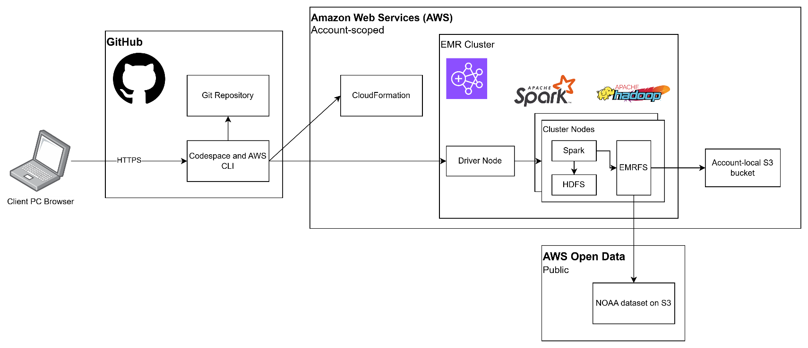

## Section 1: Installing lab dependencies and configuring AWS CLI in Codespace

Follow development environment setup instructions located in setup-docs
to ensure your AWS Academy Learner Lab is up and running, you are logged
into your GitHub Codespace, and you have cloned the repository for this
particular lab:
[**https://github.com/UST-SEIS-745-DLE-Labs/lab-01-aws-emr-connecting-to-cloud-storage**](https://github.com/UST-SEIS-745-DLE-Labs/lab-01-aws-emr-connecting-to-cloud-storage).

1.  You should now see your Codespace environment along with the cloned
    lab repository. If you need to clone the repository, open the
    command pallet (Ctrl + Shift + P on Windows) and search 'Git Clone'.
    Enter the repository URL, clone from URL, and accept the default
    location. Open the repository rather than adding it to the
    workspace.

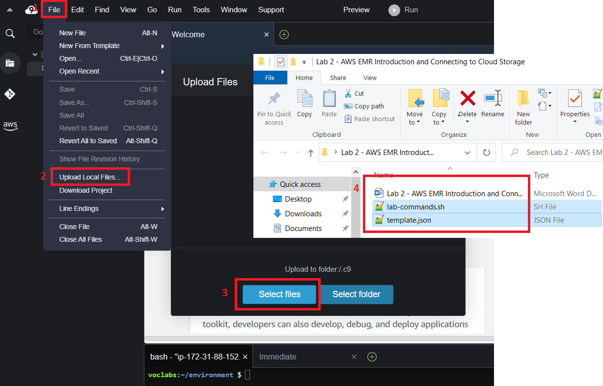Your
Codespace should look something like this, possibly with a preview of
this readme open:

2.  The 'infra' directory holds necessary infrastructure as code (IAC)
    artifacts for setting up your Codespace and deploying to AWS. Open
    codespace-init.sh and execute this bash script line-by-line in your
    terminal leveraging copy and paste. Your first time pasting, you
    will be prompted to allow data from your clipboard.\
    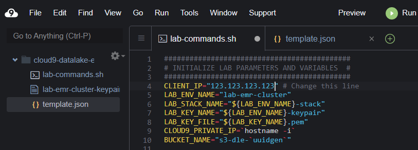

3.  Note that the script will update your Codespace VM (Ubuntu
    instance), install uuid-runtime for uuidgen, and install the
    AWS CLI. The last line prompts you to configure AWS details which
    you will need to retrieve from your AWS Academy Learner Lab. As with
    any terminal / shell / REPL interface, follow along as control
    passes from you (entering commands with Enter), to execution (you
    wait), and to the final output reaching stdout and control passing
    back to you. Once you see the familiar \$ dollar sign and cursor you
    are ready to submit the next command. Ctrl + C on Windows to cancel
    a command.

4.  After running aws configure, you are prompted for AWS CLI
    authentication and configuration details. You may grab these under
    AWS Details in your AWS Academy Learner Lab page. If you forgot to
    start your learner lab, start it now.

- AWS Access Key ID found under AWS CLI

- AWS Secret Access Key found under AWS CLI

- AWS Session Token found under AWS CLI

- Default region name: us-east-1

- Default output format: json

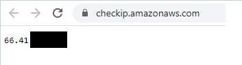

5.  Finally, open your lab-params.sh file and navigate to
    <https://checkip.amazonaws.com> in your browser. Replace the
    CLIENT_IP variable in lab-params with the IP address shown in your
    browser.

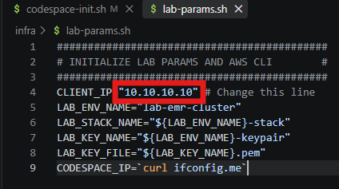

## Section 2: Create a Hadoop cluster using Amazon Elastic MapReduce (EMR), CloudFormation, and the AWS CLI

**Note:** when executing commands from lab-commands.sh do so line by
line. Be sure to observe the output on your terminal.

1.  Open infra/env-init.sh and inspect the shell script. Execute line by
    line as you go through the following instructions.

2.  The first section initialize lab environment variables from
    lab-params.sh.

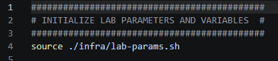

3.  The second section has several steps:

    a.  Checks for existing S3 buckets in your AWS account leveraging
        the AWS CLI.

    b.  If no S3 bucket exists, create a new one with a unique ID
        leveraging uuidgen and the AWS CLI.

    c.  Append your IP address with /32, making it a valid single-IP
        CIDR value.

    d.  Creates a key pair to use when authenticating to EC2 (elastic
        compute cloud) instances. Modify permissions on the private key
        file to make it suitable for SSH authentication.

    e.  Runs an AWS CloudFormation deploy to stand up the EMR cluster
        defined in infra/template.json. This cluster has two worker
        nodes (and a driver node) running both Spark and HDFS. This step
        may take 15+ minutes as you provision a big data cluster from
        scratch.

> 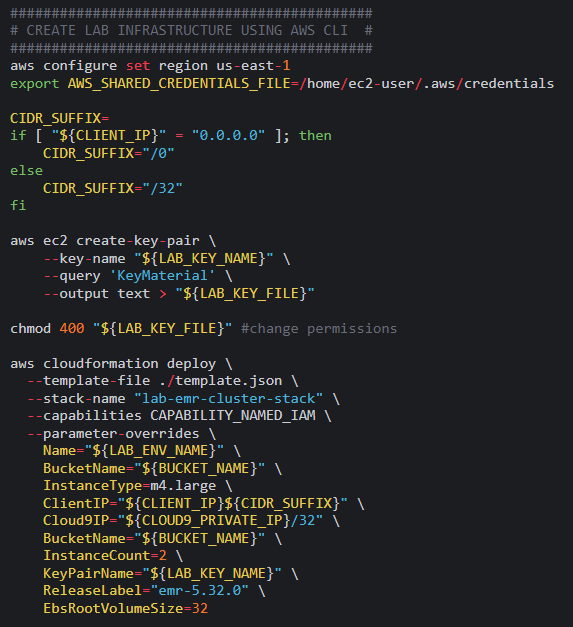

## Section 3: Take a look at the new infrastructure then transfer files and connect to the Hadoop master node

1.  While your CloudFormation deployment completes, you can view live
    progress by navigating here or searching 'CloudFormation' in the AWS
    management console:
    <https://us-east-1.console.aws.amazon.com/cloudformation>

2.  Navigate to the EC2 instances page. You should have four EC2
    instances either starting or running. Note that these were created
    when we deployed our CloudFormation template above. Specifying
    infrastructure in formats like AWS CloudFormation is known as
    infrastructure as code (IAC). This helps keep infrastructure under
    version control and in synch between environments. It also makes it
    easy to destroy and recreate infrastructure.

> View EC2 instances at <https://console.aws.amazon.com/ec2>. You should
> see all three m5.xlarge instances :

- A single Hadoop master node

- Two Hadoop data nodes

> 

3.  The following commands first leverage the AWS CLI to identify the ID
    for our running Hadoop cluster, pause execution until the cluster is
    running, and query the public host (DNS) name of the master node.
    Then, we use the private key we created earlier to connect to the
    EMR master node. When prompted, type yes to continue connecting.

Note the ASCII art welcoming you to the Amazon Linux 2023 instance and
running EMR cluster upon successful connection.

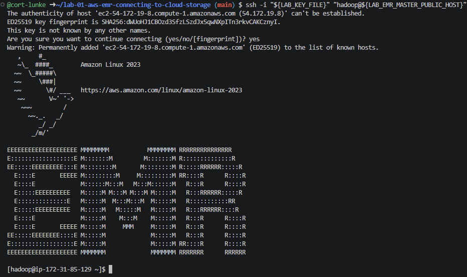
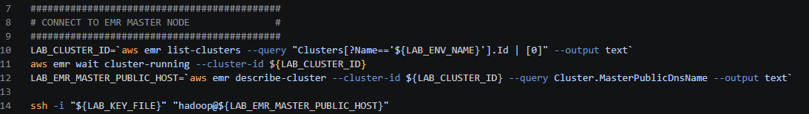

## Section 4: Bringing data into the data lake

In this section, connect to the NOAA Global Surface Summary dataset
hosted on AWS Open Data and S3 (an external S3 bucket). You will write
this data both to HDFS and to S3. You may find details on this dataset
here: <https://registry.opendata.aws/noaa-gsod/>.

1.  Open pyspark in your shell session. This will enable spark
    development in an interactive read, execute, print, loop (REPL). We
    will cover spark in more detail in later lectures. For now, read the
    dataset into a spark DataFrame from the external S3 bucket using
    EMRFS (note the s3:// scheme used in the code) and coalesce to
    reduce the number of files written in the next step:

2.  Next, write the data to your external S3 bucket. Note that the
    bucket name is passed as a driver argument when invoking your
    PySpark session, then referenced later in the script.

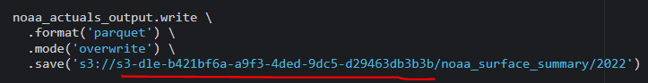

3.  Now we'll write the weather data to our HDFS instance:

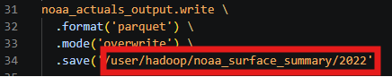

4.  Let's explore the data and execute some operations in Spark. Show 10
    records on the console, print the count of records, and execute some
    SQL to aggregate the high temperature. We'll write the average high
    temperature to HDFS and exit the pyspark console:

## Section 5: Review output in HDFS and S3

1.  Leveraging the HDFS command line interface, list files in the
    noaa_surface_summary output directory. Once you are done, you may
    exit out of your SSH session and return to your Codespace:

> 

2.  We also wrote files to your S3 bucket.
    You may view these in the AWS management console. The S3 service is
    located at <https://us-east-1.console.aws.amazon.com/s3>.

## Section 6: Destroying your Amazon EMR Cluster and inspecting lab files

The infra/env-destroy.sh script will clean up lab resources, ensuring
your AWS environment is left in a clean state when you start the next
lab or decide to rerun the current lab. Note that EMR clusters are
ephemeral; once terminated there is no restarting them. Instead, you
deploy a new cluster the next time you need it.

## Conclusion

You have now deployed a big data cluster leveraging Amazon EMR and used
that running cluster and Spark to bring data into our data lake from a
remote source. Additionally, you have connected to both cloud storage
(S3) and the HDFS instance running on EMR. Finally, you have taken small
steps to explore and process data within a data lake environment.
Reflect on the differences between cloud storage and HDFS that we
covered during lecture.
