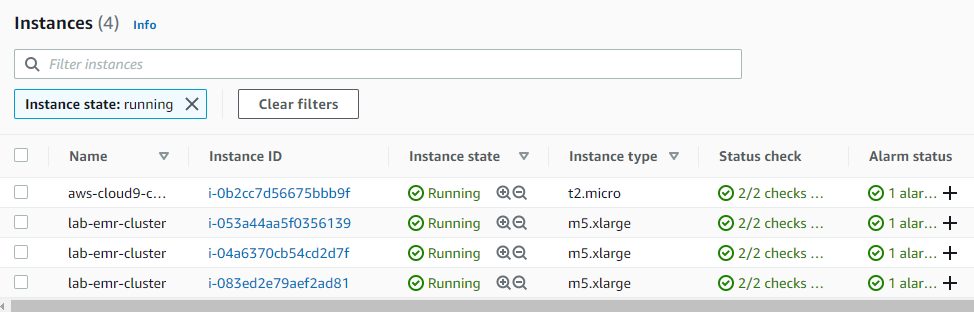
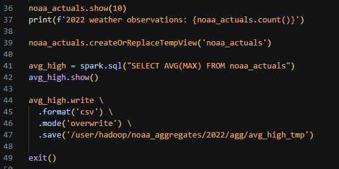
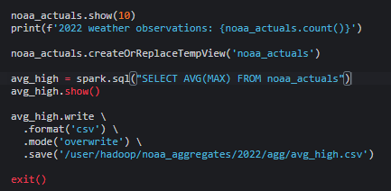
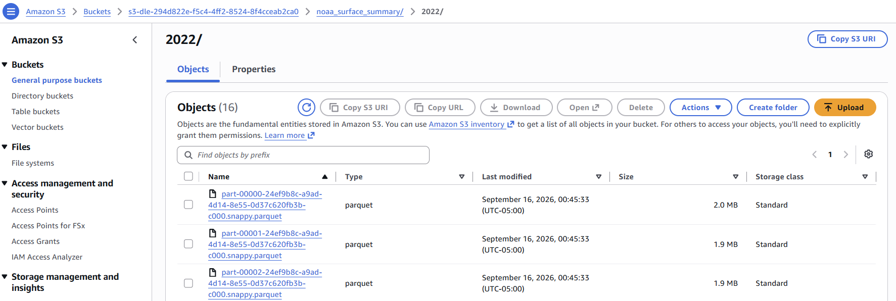

## Introduction

In this lab we will spin up a Hadoop cluster on Amazon Elastic MapReduce
(EMR) running one master node and two data nodes. For deployment, we
will leverage Amazon Web Services (AWS) CloudFormation, a cloud
Infrastructure as Code (IAC) platform. Additionally, for automating
deployment and other configuration tasks you will use a Github Codespace 
development environment and the AWS command line interface.

Once infrastructure deployment is complete, we will connect to a public
S3 bucket hosting an AWS Open Data dataset (NOAA surface readings) and
bring that into our Data Lake using PySpark. Next, you will explore the
differences between the Hadoop Distributed File System (HDFS) running on
EMR and the EMR file system (EMRFS) backed by AWS S3. In this lab, we
are using AWS S3 for data lake storage and Apache Spark on EMR for our
data lake compute.

## Pre-requisites

As a prerequisite to this lab you should have access to our class AWS
environment via <https://awsacademy.instructure.com>.

You should also have a GitHub account and access to create a new GitHub
Codespace: https://github.com/features/codespaces

Here is an overview of our development environment:

TODO add new architectural diagram

## Section 1: Create blank GitHub Codespace and Clone Repository

Notes:
- Clone repository from GitHub: https://github.com/UST-SEIS-745-DLE-Labs/lab-01-aws-emr-connecting-to-cloud-storage
- Readme may be previewed directly in Codespace or on GitHub Repository home page
- In order for instructors to maintain this repository, you'll need to configure git subtree to work appropriately.  
Seems to be an issue with the Git installation on this version of Ubuntu.  Creating a symbolic link fixes this: 
```
sudo chmod +x /usr/share/doc/git/contrib/subtree/git-subtree.sh
sudo ln -s /usr/share/doc/git/contrib/subtree/git-subtree.sh /usr/local/libexec/git-core/git-subtree
```
- For maintenance of these labs we will want something of a developer's guide in its own repository.
- In order to push to main and feature branches from codespaces, you need to reauthenticate with 
github and update git cli credentials like so:
    ```
    export GITHUB_TOKEN=
    gh auth login
    gh auth setup-git
    ```

TODO Complete Section 1 with detailed instructions

## Section 2: Install AWS CLI, update lab parameters, and install other dependencies

Steps for this section are included primarly in ./infra/codespace-init.sh.  This seemed
the most approrpiate place to install necessary dependencies on codespace as they will
in large part be determined by what is needed for deploying the infrastructure.  If there 
are differences across labs, we can just install a superset of dependencies needed for all labs
which use that particular infra environment.  A bit of extra overhead but no real harm done.

AWS Configure parameters will need to be taken from your AWS Academy / Vocareum lab environment.
Navigate to 'AWS Details', 'AWS CLI', and then click 'Show' from your Learner Lab environment page.
Here you will see your aws access key id, aws access key, and aws session token.

In addition to installing dependencies, you will need to navigate to checkip.amazonaws.com and 
update the Client IP address parameters.

Note that all shell scripts here are expected to be entered into the terminal line by line,
building student familiarity with the terminal / REPL flow, Linux utilities, git/aws CLIs,
reading stdout, and troubleshooting issues as they arise.

Another way to configure the AWS CLI is to place it within the container definition.  May look
at Organization codespaces and container features later on.

TODO complete section 2

## Section 3: Take a look at the new infrastructure then transfer files and connect to the Hadoop master node

1.  Navigate to the EC2 instances page. You should have four EC2
    instances either starting or running. Note that these were created
    when we deployed our CloudFormation template above. Specifying
    infrastructure in formats like AWS CloudFormation is known as
    infrastructure as code (IAC). This helps keep infrastructure under
    version control and in synch between environments. It also makes it
    easy to destroy and recreate infrastructure.

> EC2 instances at <https://console.aws.amazon.com/ec2>:

- A t2.micro instance used by our Cloud9 environments (your terminal
  window)

- A single Hadoop master node

- Two Hadoop data nodes

> {width="7.5in" height="2.4027777777777777in"}

2.  The following commands first leverage the AWS CLI to identify the ID
    for our running Hadoop cluster, pause execution until the cluster is
    running, and query the public host (DNS) name of the master node.
    Then, we use the private key we created earlier to connect to the
    EMR master node.

{width="6.666666666666667in"
height="0.9444444444444444in"}

{width="4.460442913385827in"
height="2.725in"}

## Section 4: Bringing data into the data lake

In this section, connect to the NOAA Global Surface Summary dataset
hosted on AWS Open Data and S3 (an external S3 bucket). You will write
this data both to HDFS and to S3. You may find details on this dataset
here: <https://registry.opendata.aws/noaa-gsod/>.

1.  Open pyspark in your shell session. This will enable spark
    development in an interactive read, execute, print, loop (REPL). We
    will cover spark in more detail in later lectures. For now, read the
    dataset into a spark DataFrame from the external S3 bucket using
    EMRFS (note the s3:// scheme used in the code) and coalesce to
    reduce the number of files written in the next step:

{width="5.520833333333333in"
height="2.3125in"}

2.  {width="7.5in"
    height="0.9645833333333333in"}{width="7.5in"
    height="1.3430555555555554in"}Next, write the data to your external
    S3 bucket. Note that you will need to replace bucket_name with your
    S3 bucket ID. This can be found here:
    <https://s3.console.aws.amazon.com/s3/buckets?region=us-east-1>.

3.  Now we'll write the weather data to our HDFS instance:

{width="4.135416666666667in" height="0.78125in"}

4.  Let's explore the data and execute some operations in Spark. Show 10
    records on the console, print the count of records, and execute some
    SQL to aggregate the high temperature. We'll write the average high
    temperature to HDFS and exit the pyspark console:

{width="4.510416666666667in"
height="2.2083333333333335in"}

## Section 5: Review output in HDFS and S3

1.  Leveraging the HDFS command line interface, list files in the
    noaa_surface_summary output directory.

> {width="6.447916666666667in"
> height="1.0729166666666667in"}

2.  From the AWS management console, find your S3 bucket and browse
    files. You may traverse the object namespace, download objects,
    delete objects, and more from the AWS console:
    <https://s3.console.aws.amazon.com/s3/buckets?region=us-east-1>

## Section 6: Destroying your Amazon EMR Cluster and inspecting lab files

1.  In a normal production environment you would leave your big data
    environment up and running or leave the data stored on S3 for when
    you turn your cluster back on. However, since we are on a student
    lab budget we will destroy our environment at the end of each lab.

The env-destroy.sh script will take care of cleaning up lab resources.

2.  Finally, reflect on the lab and inspect the template.json file and
    CloudFormation commands used to automate cluster deployment.

## Conclusion

You have now used a running EMR cluster and Spark to bring data into our
data lake from a remote source. Additionally, you have connected to both
cloud storage (S3) and the HDFS instance running on EMR. Finally, you
have taken small steps to explore and process data within a data lake
environment. Reflect on the differences between cloud storage and HDFS
that we covered during lecture.
