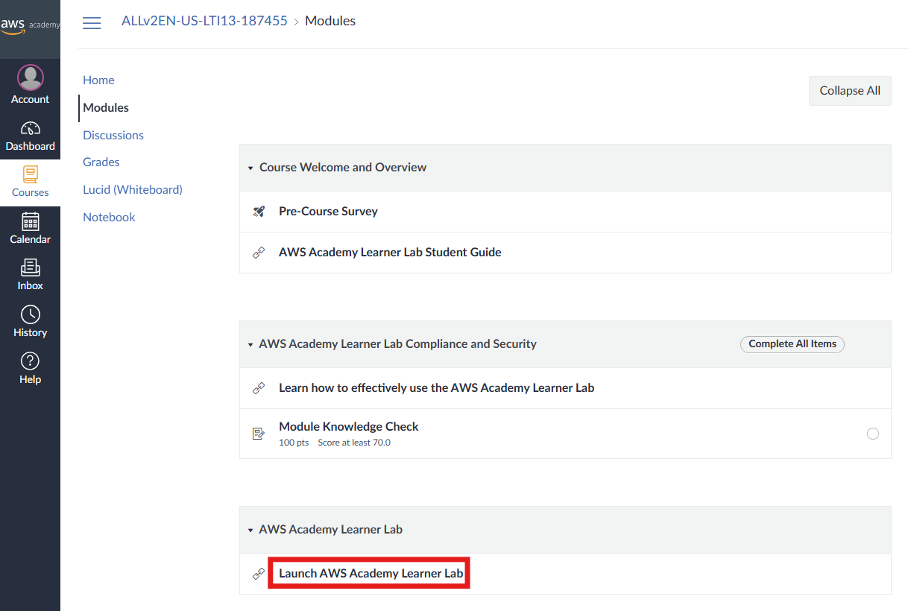
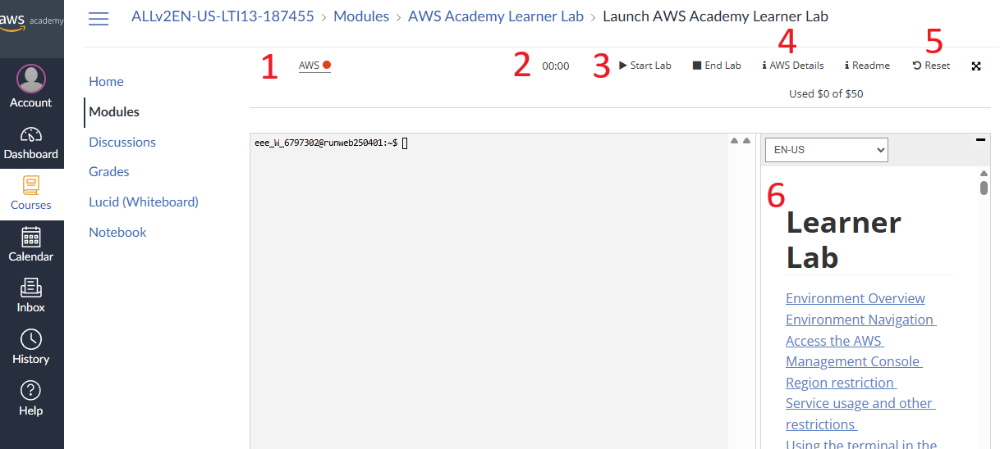
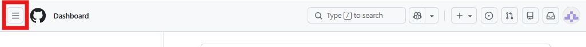
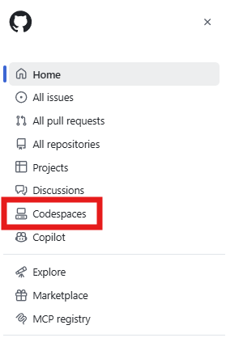
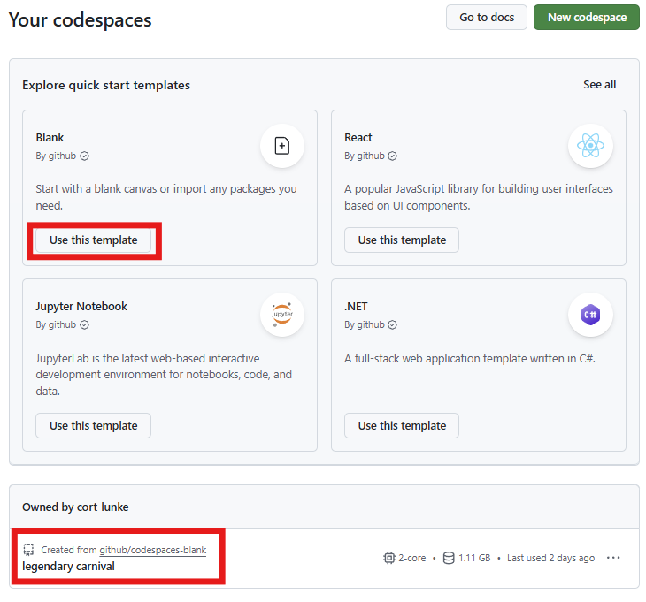
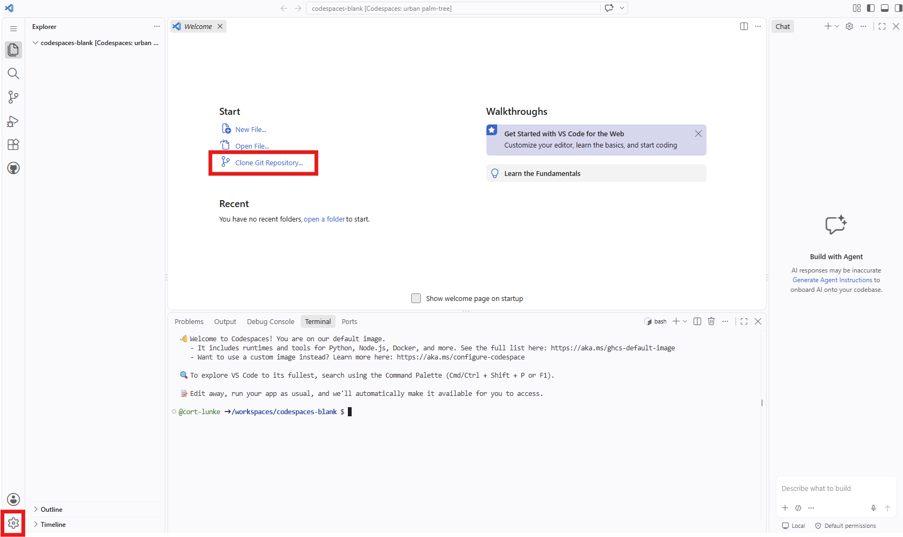

# Lab pre-requisites: Starting your AWS Academy Learner Lab and GitHub Codespace 

# Navigating to the AWS Academy Learner Lab

Prior to our first lecture, you received an email to your UST email
address inviting you to join our AWS Academy class. Note that your login
is separate from your UST login and that the Canvas instance used by AWS
Academy is separate from the UST Canvas site. Follow instructions to
register for our AWS Academy Learner Lab. A deep link to our AWS Academy
class is included under Module 0.

Once your are successfully registered, follow these instructions to
start your lab environment. Note that thorough student documentation is
also included in our AWS Academy class.

1.  Log into the AWS Academy portal: <https://www.awsacademy.com>.

2.  Once you have logged in and selected the appropriate class, navigate
    to Modules and select 'Launch AWS Academy Learner Lab'. Please
    explore other class material as needed.\
    

3.  Your first time using the lab you will have to agree to the terms of
    service. If you see a blank screen, refresh the page.

# Traversing the AWS Academy lab page

Numbers in the labeled AWS Academy Learner Lab page correspond to the
following features:

1.  A hyperlink that takes you to the AWS management console, logged in
    as your student account in AWS Academy. A red/yellow/green status
    indicator corresponds to a stopped/starting/running lab environment
    consecutively.

2.  The duration of time left in your active lab session, if running.
    Counts down from 4 hours.

3.  A start button which either a) starts your lab (if stopped) or b)
    resets your 4 hour lab timer (if running). The stop button ends your
    current lab session.

4.  AWS details will show your AWS CLI credentials and other account
    information.

5.  Click this button to hard reset your lab environment, destroying all
    resources, deleting your student account in AWS, and creating a
    completely new one for you. Takes 15-30 minutes and is generally the
    last step in troubleshooting.

6.  The AWS Academy Learner Lab readme, detailing limits and
    instructions for specific AWS resources.

# Creating your first GitHub Codespace

You should already have a GitHub account, ideally associated with your
UST email address. Once logged in, you can create a Codespace, clone the
lab git repository, and get started with the lab.

1.  Navigate to the hamburger menu in the top left corner of the page:

2.  Select 'Codespaces':

3.  Select the Blank template. Note that when you return you will have
    the option to select an existing Codespace, also shown below:

4.  You will briefly see a 'Setting up your Codespace' message. Once
    your VS Code instance is up and running, you will be prompted to
    trust files in the current folder. Trust the folder and continue.

5.  You should now see a page similar to this. You may click the gear
    icon in the bottom left corner to access settings, including the
    ability to switch between light and dark themes. Refer to the AI
    Usage Policy when using chat and agent features.

Click 'Clone Git Repository', enter the repository URL for the current
lab, and hit enter to pull in lab artifacts including code and readme
files. When prompted, select the default destination and 'Open' option.

6.  You are now ready to begin your lab.
